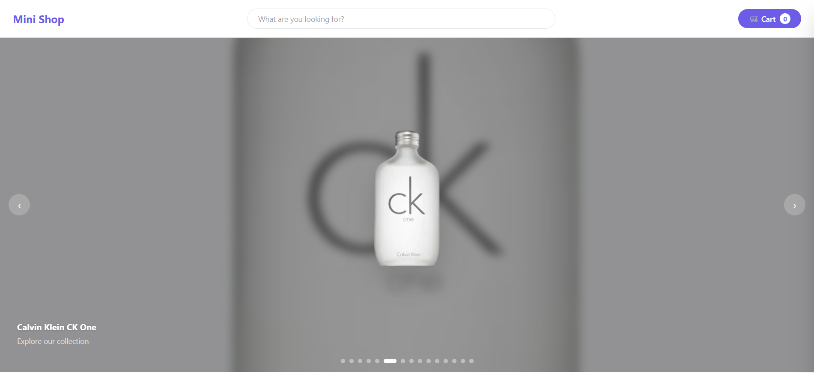
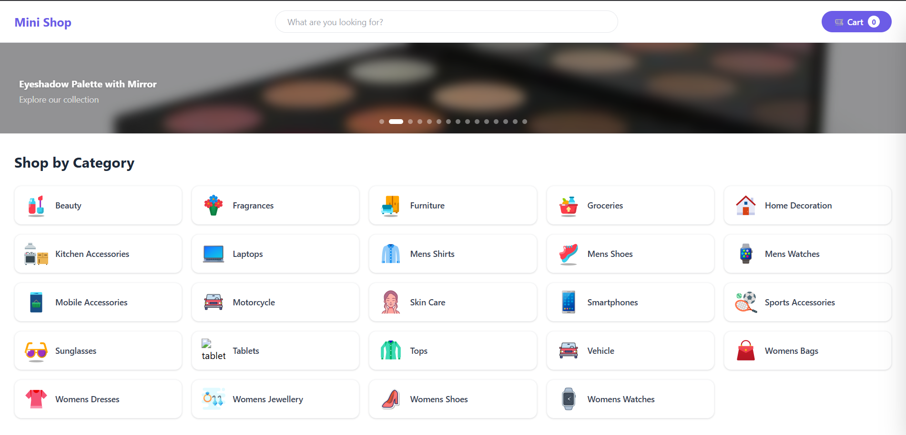
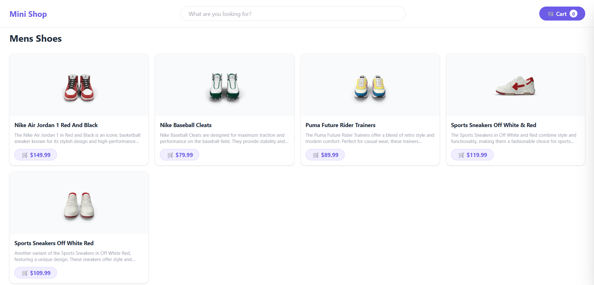
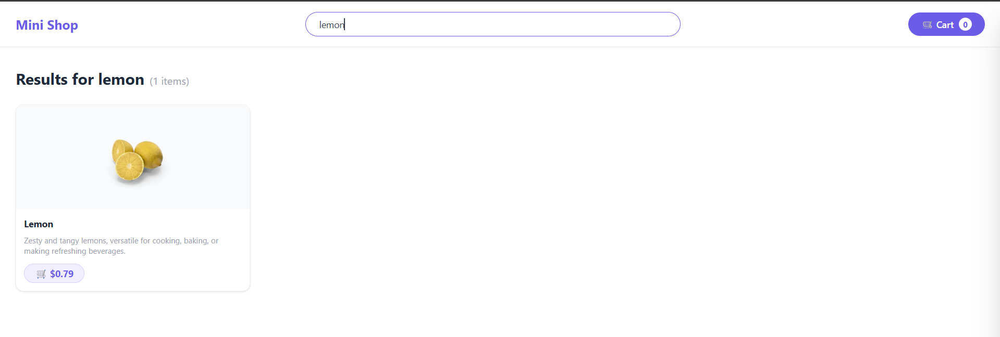
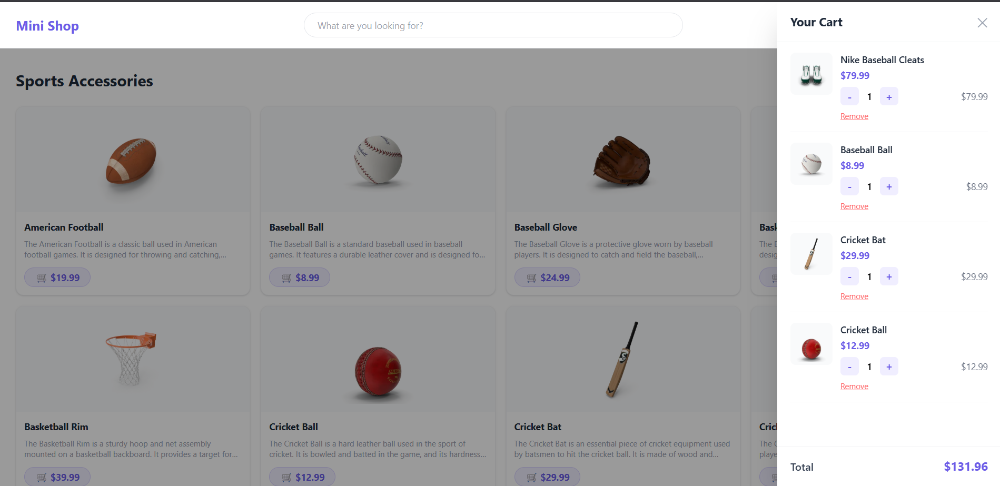

# 🛍️ Mini Shop — Product Cart System

A shopping cart application built using React, TypeScript, and Tailwind CSS. The project focuses on learning React concepts through a functional e-commerce style UI with category browsing, live search, cart management, and persistent storage.

## 📸 Demo Preview

## 🚀 Features
- Hero carousel with auto-slide controls
- Browse products by category
- Navigation using React Router DOM
- Live product search with debouncing
- Add/remove products from cart
- Quantity management in cart drawer
- Notification on product added to cart, removed from cart
- Dynamic cart total calculation
- Cart persistence using localStorage
- Responsive UI with Tailwind CSS

## 🧰 Tech Stack
- React + TypeScript
- Tailwind CSS
- Vite
- DummyJSON API
- localStorage API

## 🔌 APIs Used
Using DummyJSON API:
- `/products?limit=8` → Hero carousel 
- `/products/category-list` → Categories 
- `/products/category/:name` → Category products 
- `/products/search?q=:query` → Search 

## 🧠 Concepts Practiced
- React Hooks (`useState`, `useEffect`)
- React Router DOM navigation
- TypeScript interfaces and types 
- Conditional rendering 
- Debounced API search 
- Cart state management 
- localStorage persistence 
- Component-based architecture 

## ⚠️ Challenges Faced
1. Handling async API calls correctly  
2. Preventing excessive search API requests  
3. Restoring cart after refresh  
4. Handling navigation between pages
5. Keeping cart state synced with UI  

## 🎯 Solutions Implemented
1. Used `useEffect` for API handling  
2. Added debouncing with `setTimeout`  
3. Used lazy initialization for `localStorage`  
4. Applied TypeScript safety checks  
5. Structured reusable components for readability  

## 🔮 Future Improvements
* Product detail page
* Checkout flow
* Product filtering and sorting
* Pagination support